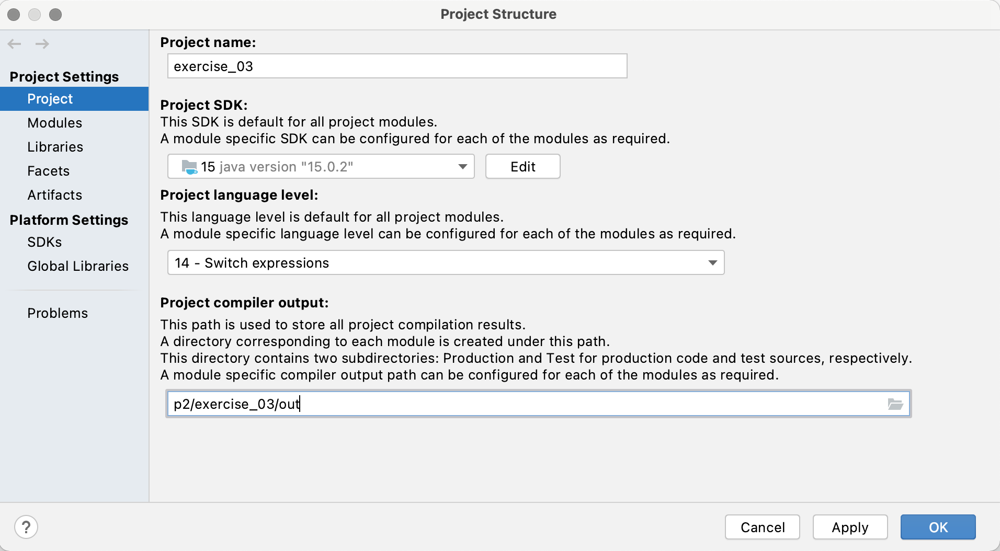

# Exercise 03
The third lecture covers *Design by Contract*, a methodology for designing systems by specifying pre-and
post-conditions (i.e. input requirements and output guarantees), as well as class invariants (i.e. conditions
that must hold between public method calls). In this exercise, we'll practice this methodology by implementing
a simple interactive game.

## Problem Description
The WHO has decided to make a fun little toy game for users to learn programming within
these pandemic times: the Covid-21 language!

Users write programs composed of the following commands (one command per line), telling a human to walk
over the screen:
* `left <n>`: Moves the human to the left by `n` steps.
* `right <n>`: Moves the human to the right by `n` steps.
* `up <n>`: Moves the human up by `n` steps.
* `down <n>`: Moves the human down by `n` steps.

An example program is given like following:
```covid-21
right 10
down 5
left 5
up 10
```

You start with an empty class `Environment`, which returns a `48 * 48` matrix of `Area`s.
Each entry in the matrix denotes whether that particular field is `SAFE`, has a `COVID` infection or
has been touched/entered already: `TRAIL`.

The environment should have some (randomly or not) infection hot spots, represented with a `COVID` area.
Upon entering such a `COVID` area, the human will be placed under quarantine and **should not able to proceed
any further**. Therefore, it is important for the user to write "smart" programs, which omit to enter such
threatening places.

Your task is to implement this game. You are free to add as many classes as you want, and you are allowed
to modify existing ones except for `CovidRenderer`.

In order to pass this exercise, your solution **must** meet the following criteria:

* Split parsing and execution of programs in separate classes/objects.
* In your API documentation, explicitly state pre-and post-conditions.
* Check your pre- and post-conditions using the `assert` keyword.
* Check class invariants.
* Your solution must reasonably deal with all input programs in exactly the way that your contracts describe.
* Write proper class comments. You should explain the class responsibilities and state invariants.
Try to document as many details as possible, without writing how exactly the implementation works on the code level.
* Include a UML class diagram that shows the communication and connections between your classes.
* Include a UML sequence diagram that shows the method invocations that happen in your program when the method `Environment.createFrom(...)` is called.
* Both UML diagrams must be created manually (you are not allowed to use tools that generate diagrams from source code).
Scan your handwritten diagrams or take a photo.
* Note that you cannot assume that the input is always a correct Covid-21 program.
The method `Environment.createFrom(...)` is invoked after every keystroke!
Your program should deal with invalid input, for example by ignoring commands that cannot be parsed.

The WHO thanks you for your cooperation to making the world more fun!

## Hints
* You can play the game interactively by running the main method of the `CovidRenderer` class.
This class implements a simple GUI where you can enter a Covid-21 program which is then passed to the
`Environment`.
* **Make sure that assertions are turned on!** Otherwise, the contracts are not checked when you run the program.
(Pass the `-ea` flag to the JVM)
* Keep the reading material from the last exercise (in particular the sections on how to format JavaDoc) in mind.
* Remember that class invariants only need to hold before and after *public** method calls.
* **Read the comment in `Environment.createFrom(...)` which outlines an approach you could take to solve this exercise.

## Setup the exercise in IDE (Intellij)
As this exercise use a feature of Java 9 ( e.g `var right = new JPanel();`), 
you need to ensure that you set up the language level of the project properly.
To ensure, you can follow the steps Menu -> Project Structure -> Project, and check if the JDK is 15 and language level is 14 at least.


## Mandatory Reading Material
* *Applying 'Design by Contract'* by Bertrand Meyer (available on the course website). The contents are relevant to the exam.

## Deadline
Submit your solutions by pushing your code to the git repository by
___Friday, 19 March, 13:00___.