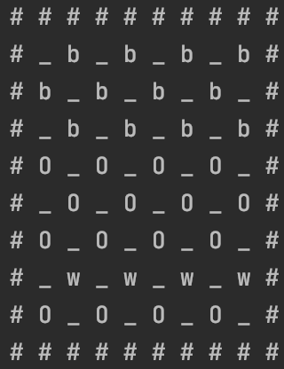
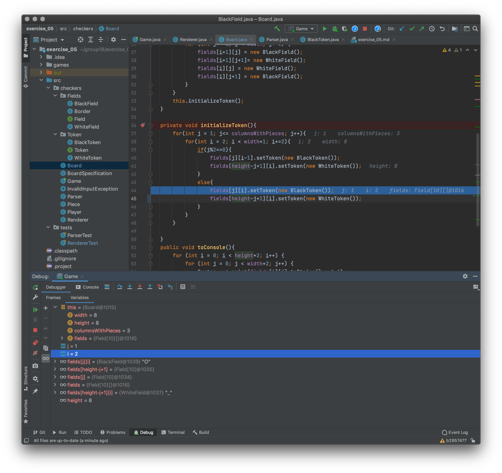
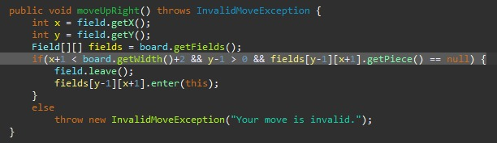
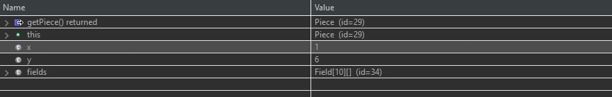

# Debugger usage
## Problem 1

The debugger was used to solve an issue with the renderer. The issue was that some rows of white pieces were not rendered.
it looked like this:
#### our problem:


Unfortunately we did not take a screenshot, but we recreated the bug and here it is:
#### using the debugger:

We created a breakpoint at the method were we thought the error might occur, then started the debugger.

With step in to we "stepped in to" the method. To search for the bug we had a look at what value each variable had.
At some point we saw that somewhere in our logic an error had occurred.

After some more playing around with the debugger, we found out how to solve the bug,
a `-1` was added, and the problem is solved.
#### From this:
```java
fields[height-j+1][i].setToken(new WhiteToken());
```
#### To this:
```java
fields[height-j+1][i-1].setToken(new WhiteToken());
```
## Problem 2

Whilst implementing the move methods we also stumbled over a bug in our code.
When calling the moveUpRight method the Piece moved upRight,
when called a second time the exception was thrown. At first, we didn't know how to approach this problem.
The debugger came in handy. 
#### our problem code which threw the exception:


With the debugger we saw that the destination's piece `getPiece()` and the current `this` were the same ones (both id=29).
#### using the debugger:


Trough the use of the debugger the problem was recognized and resolved to fix it we simply had to change the piece which was moved.
so we changed our code in the `if()` statement
#### From this:
```java
field.leave();
fields[y-1][x+1].enter(this);
```
#### To this:
```java
field.leave();
fields[y-1][x+1].enter(this);
this.field = fields[y-1][x+1];
```
***
###### *Unfortunately we didn't encounter more bugs.*
