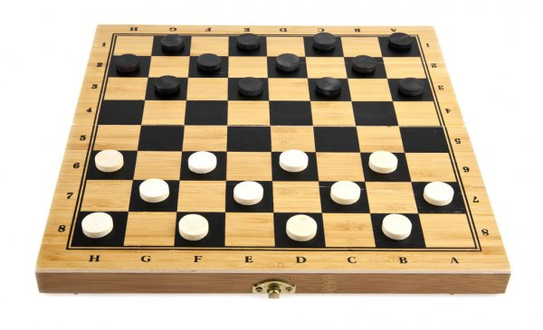

# Exercise 5

This week, we start with the implementation of a simple board game called **Checkers** aka **Draughts**.
The goal is to apply the concepts that we have covered so far including object-oriented design principles,
design by contract, responsibility driven design, unit testing, JavaDoc and UML. We aim for a well-designed
basic game implementation that you will develop over the course of three exercises.

## Problem Description


*Checkers* is a strategy board game for two players which involves diagonal moves of uniform game pieces
and mandatory captures by jumping over opponent pieces. The most popular version is *English Draughts*
(aka *American Checkers*) which is played on an 8x8 checkerboard, but there are various other forms such
as *International Draughts* or *Canadian Draughts* which are played on larger board sizes.

Player 1 has the black pieces and starts the game. Player 2 is placed on the opposite side of the board and
uses the white pieces. Both players alternate turns. A turn consists of moving a piece diagonally to an adjacent
unoccupied dark square. If the adjacent square contains an opponent's piece and the square immediately
after is empty, the current player may capture the piece by jumping over it and removing it from the board. 
Default pieces may only move forward and capture opponent's pieces diagonally either on the left or right.
Once a piece reaches the opponent's side, it becomes a king which allows it to move both for- and backward
on the board. A player wins the game by either removing all opponent's pieces from the board or locking all
opponent's pieces so that he's unable to move any of them.  

For more details on the general rules please refer to the [*Checkers Rules*](checkers_rules.md) markdown file in the exercise folder.
A quick summary of the rules can also be found in this [YouTube](https://youtu.be/Kwswrsb8UW4) video.

Your task in this and both upcoming exercises is to implement your own *Checkers* game from scratch.
This week, you will start with the basics for setting up the game and printing the game state to the terminal.


### Board Specification File
As you develop the game, you can rely on the game rules provided in the markdown file in the exercise folder.
To make it a little more interesting however, we allow players to customize the parameters of the game board
by specifying them within a **board specification file**, which is parsed at the beginning of the game and 
includes parameters for board width/height and the number of rows which are occupied by one player's pieces.
With those details, we define the following format for a *board specification file*:
```
boardWidth boardHeight numberOfRowsOfBlackOrWhitePieces
```
For example the default *English Checkers* game with an 8x8 checkerboard and 3 rows of black/white pieces,
as seen in the above image, has the following *board specification file*:
```
8 8 3
```


### Board Rendering
Similar to *Snakes & Ladders*, the full board should be rendered after each move with simple print statements.
To print the different objects of a *Checkers* game, we define the following rendering scheme:

`#` Wall/Edge of the board
`O` Dark Square
`_` Light Square
`b` Black Piece
`w` White Piece
`B` Black King
`W` White King

The default game as seen above is therefore rendered as follows:
```
##########
#_b_b_b_b#
#b_b_b_b_#
#_b_b_b_b#
#O_O_O_O_#
#_O_O_O_O#
#w_w_w_w_#
#_w_w_w_w#
#w_w_w_w_#
##########
```
Each board specification is stored in an individual file which can be found in the `games/` folder.
The above example is stored as `default.txt`.

**Note:** Feel free to create your own rendering scheme if you want to use different characters to better
visually represent the above game objects. However, if you decide to do so, please provide us your custom
rendering scheme so that we can understand its various parts.


## Tasks
In order to pass exercise 5, you need to implement all of the following tasks.

### Parser
Implement a **parser** that reads **board specification files** from the `games/` folder and creates a
game instance based on it. Write **tests** that make sure that the parser correctly creates the game.
Note that you should not depend on the renderer to do this! It should be possible to read a specification
from a file and then check if the created game matches those requirements.  
Your implementation of the parser should also handle **invalid files**, meaning that badly formatted files
or specifications with logical errors are rejected:
- *Badly formatted*: `8 8 A` (parameter includes letter instead of number)
- *Missing parameter*: `8 8 ` (no parameter for number of rows of black/white pieces)
- *Logical error*: `8 8 4` (board full of pieces - no empty dark squares)
- *Board requirements*: Width and height must be even with a minimum size of 6.

### Renderer
Implement a **renderer** that prints a game state to the standard output as described above and write
**tests** that make sure that the renderer prints the given games correctly. Here you need to create
games without using the parser to test the implementation independently.

### Game / Pieces
Implement the ability to **move pieces**, meaning that it should be possible for a player to diagonally move
a piece on the board by one step. You can visually verify whether the movement has taken place by rendering
the board before and after executing the command. However, you should also write **tests** that do not
depend on the renderer. There is no need to implement the main loop for playing the game yet, just the
functionality that moves individual pieces on the board. You can for example implement methods such as
`Piece#moveUpRight()` to do this and then write tests that cover these methods.

### Debugger 
As you write your code and perform your magic, you will certainly run into situations where you don't understand
your own magic. At that point, please use the debugger. Take screenshots and use them to explain how the debugger
can help wizards in need to solve their problems. Create a markdown file named `debugger.md` where you embed
the images and use proper markdown syntax to format the document as you explain your magic spells that helped
you unravel the mysteries of your previous work. The file must contain **at least 3 problems** that you fixed using
the debugger. Uniquely for this exercise, we will tolerate slightly incomplete solutions as long as you show proper
knowledge of debugging.

### UML Diagram
Your last task of this exercise is to create a **class diagram** of the current state of your game. Include all relevant
classes incl. their relations, variables and methods to give an overview of the project. The purpose of the class
diagram is to give newcomers to the project a better idea of all the important parts of your game, so a good level
of abstraction is key to not litter your diagram with unnecessary details (e.g. private helper methods and so on).
Additionally, the class diagram should help you to plan ahead and give you a better understanding of what and how
you want to develop in the next two exercises to complete the game. Read through the *Checkers* rules and identify
the remaining classes that you will likely need to implement and add them as well. Identifying their responsibilities
now will ease up the process of adding the upcoming features.  
Submit the class diagram as either an **image or PDF** within the exercise folder and name it `class_diagram_ex5`.

### General Notes
- You are mostly free to design the game to your own desire, but you should follow the design principles that
  we learned so far. You can take a look at the *Snakes & Ladders* implementation to get an idea of how your
  classes should be structured. We have provided some classes for this exercise in the src folder but they lack an implementation. Feel free to
  use them or modify them accordingly (e.g. to change them into interfaces if necessary).
  **Note: You must have dedicated classes for**: *Game, Board, Player, Piece, Parser and Renderer*.
  
- You do not have to implement a fully functional game yet! This week, we focus on parsing, rendering and
  basic movement of pieces. There's no need to implement any game logic yet (such as checking whether a
  move is valid or if a player has won the game).

- Write proper **JavaDoc** comments covering **classes and methods**.

- Do not forget about **design by contract**.


## Deadline
Submit your solution by pushing your code to your group repository until:
___Friday, 2 April, 13:00___